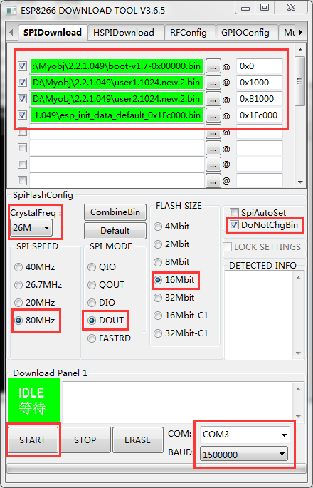

# M0E1系列模块烧写说明

### 1. 工具下载

请先下载M0E1系列模块下载，打开后选择ESP8266，具体连接：[点击查看](http://mqlinks.tpddns.cn:1888/kodexplorer/index.php?share/folder&user=100&sid=Di6XTcsn)

### 2 工具配置

SPI SPEED:80MHz

SPI MODE:DOUT

FLASH SIZE:16Mbit

DoNotChgBin:勾选

固件烧写位置：

user1.1024.new.2.bin 0x1000

user2.1024.new.2.bin 0x81000

#### 特别注意：如果有spiff_rom.bin，则下载至地址0x100000

